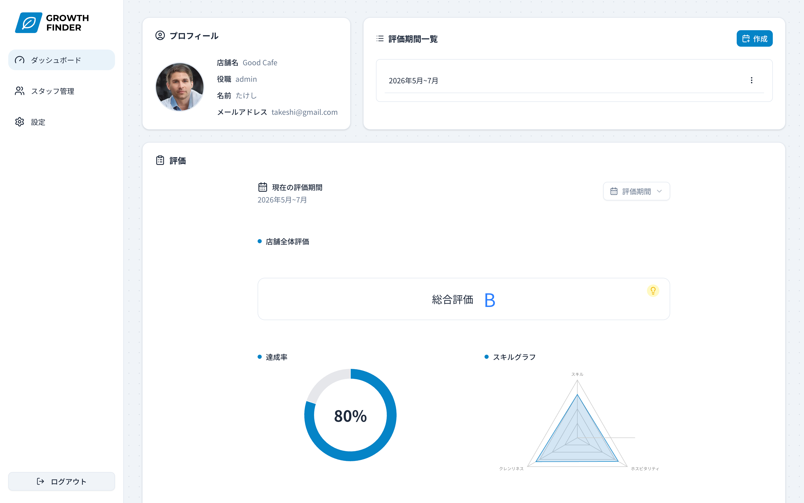
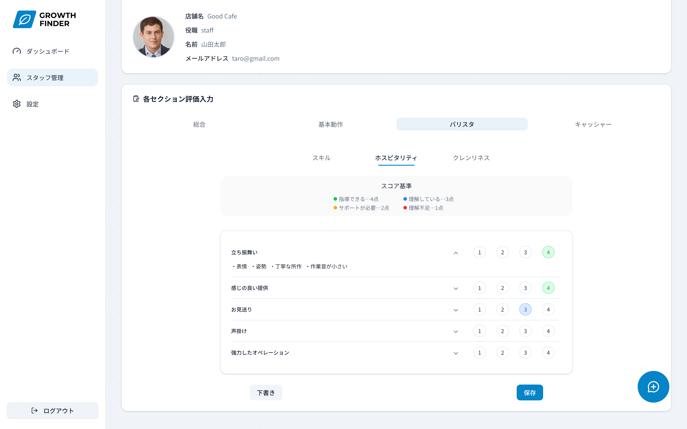
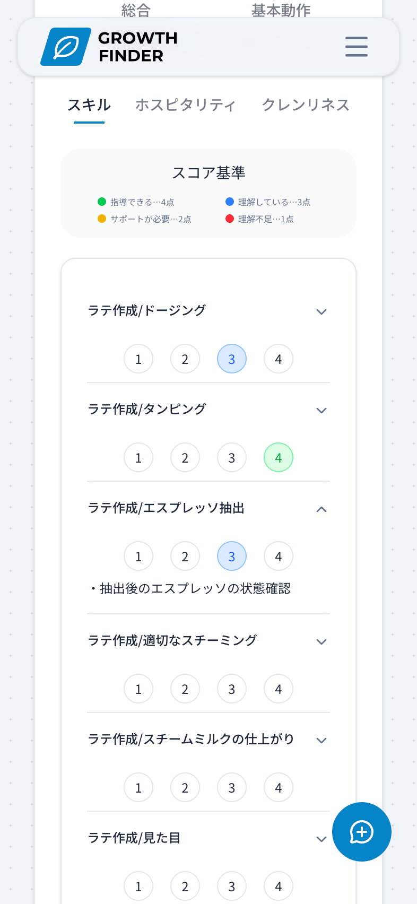
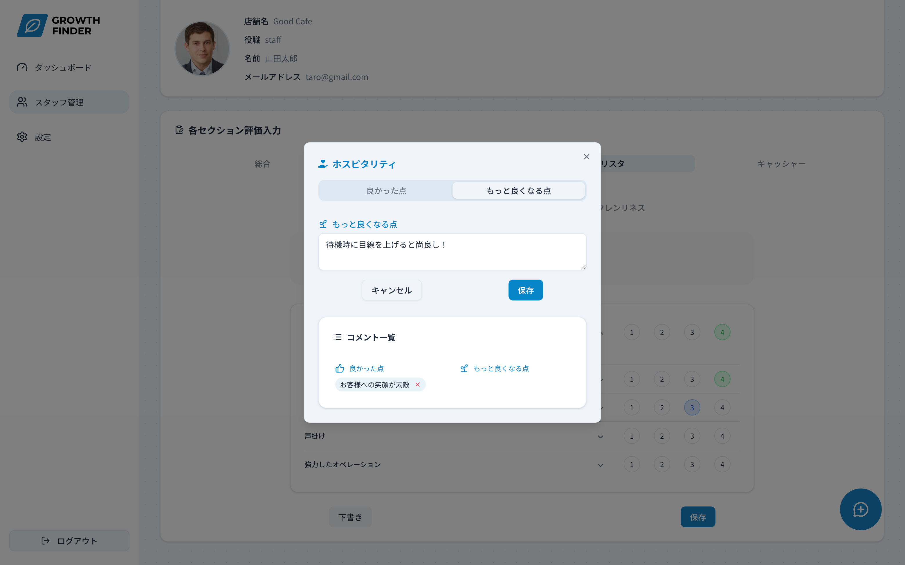
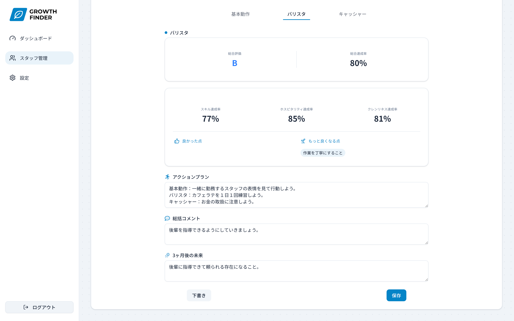
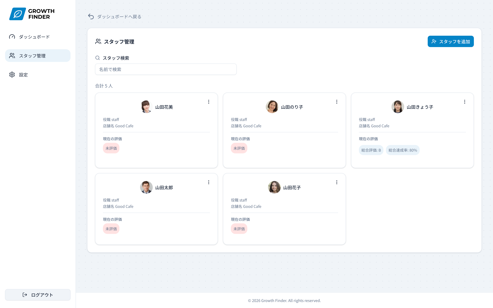
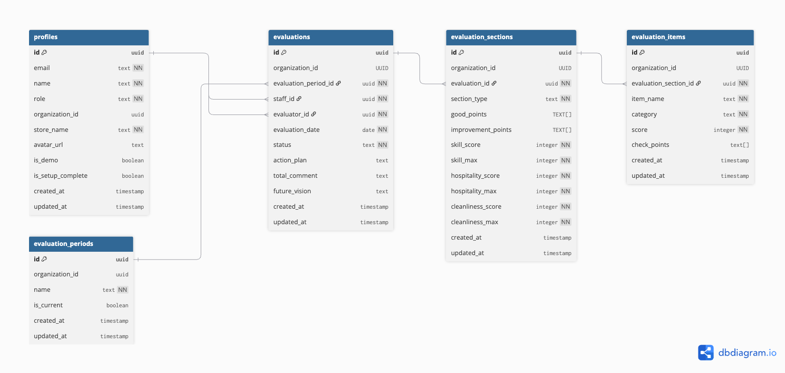

# Growth Finder

> スタッフの成長を可視化し、店長とスタッフの関係性構築を支援する人材育成ツール

[](https://nextjs.org/)
[](https://www.typescriptlang.org/)
[](https://supabase.com/)
[](https://vercel.com/)



**デモサイト**: [https://growth-finder-psi.vercel.app/](https://growth-finder-psi.vercel.app/)

---

## デモを試す

デモアカウントの登録は不要です。ファーストビューの **「デモで今すぐ試す」** ボタンから、
ワンクリックでアプリの全機能を体験できます。

**デモサイト**: https://growth-finder-psi.vercel.app/

> 💡 デモ環境では、評価入力・履歴閲覧・ランク算出など主要機能をすべてお試しいただけます。
> アカウント登録なしで、面接・カジュアル面談中にもすぐご確認いただけるよう設計しました。

---

## 目次

- [プロジェクト概要](#プロジェクト概要)
- [開発背景 ― 現場の課題から生まれたアプリ](#開発背景--現場の課題から生まれたアプリ)
- [主な機能](#主な機能)
- [技術スタックと選定理由](#技術スタックと選定理由)
- [システム設計](#システム設計)
- [実装で工夫した点・こだわり](#実装で工夫した点こだわり)
- [苦労した点と解決方法](#苦労した点と解決方法)
- [今後の実装予定](#今後の実装予定)
- [セットアップ方法](#セットアップ方法)
- [開発者について](#開発者について)

---

## プロジェクト概要

**Growth Finder** は、カフェなどの飲食店におけるスタッフ育成を支援する Web アプリケーションです。

カフェ店長として 13 年の現場経験から生まれた「伸びしろ発見チェックシート」をデジタル化し、スタッフの成長を可視化・共有することで、店舗全体のレベル向上と、店長・スタッフ間の信頼関係構築を目指します。

- スタッフの評価をデジタル化し、成長を可視化
- 評価結果を対話の起点にして、関係性構築を支援
- 過去の履歴を一元管理し、店長交代時の引き継ぎも円滑に

---

## 開発背景 ― 現場の課題から生まれたアプリ

### 現場で感じた 3 つの課題

カフェ店長として日々スタッフと向き合う中で、以下の課題を強く感じていました。

1. **スタッフが思うように動いてくれない**
2. **スタッフ自身が「自分の何が成長したのか」を実感しにくい**
3. **1on1 の場で「何を話すか」のきっかけが作りにくい**

### アナログ運用時代

そこで、QHC(Quality / Hospitality / Cleanliness)の評価フレームワークを基に、自分で**「伸びしろ発見チェックシート」を Excel で作成**しました。

- [開発コンセプトスライド](./docs/concept-slides.pdf) ― なぜこのツールを作ったのか
- [伸びしろ発見チェックシート](./docs/growth-finder-sheet.pdf) ― 自作したツール(印刷用)

実際に現場で運用したところ、スタッフとの対話の質が大きく変わりました。
**「店長から見た自分」と「自分が思う自分」のギャップを認識することで、スタッフ自身が成長の方向性を自覚できる**ようになりました。

### アナログ運用の限界

しかし運用を続けるうちに、新たな課題が見えてきました。

| 課題                           | 具体例                                             |
| ------------------------------ | -------------------------------------------------- |
| **データの一元管理が困難**     | スタッフ毎の紙シートが店舗に散らばる               |
| **履歴の参照に時間がかかる**   | 「3 ヶ月前の評価どうだったっけ？」がすぐ見られない |
| **店長交代時の引き継ぎが煩雑** | 紙束を渡しても、評価の文脈までは伝わらない         |
| **集計・可視化ができない**     | スタッフ全体の傾向や、本人の成長曲線が見えない     |

この課題を解決するため、**Excel で作ったツールを Web アプリケーション化**することにしました。これが Growth Finder です。

> **このプロジェクトの本質**
> 単なる評価システムではなく、「**店長とスタッフの関係性を構築し、信頼の土台を作るためのツール**」として設計しています。

---

## 主な機能

### 注目機能

このアプリのコアとなる機能を実装の意図とともに紹介します。

#### 1. 評価入力フォーム

ネストタブ UI で、４カテゴリ ×3 観点を直感的に評価できます。
現場で店長がスマートフォンで入力するシーンを想定し、評価ボタンを横並びに配置するなど、モバイルでの操作性・タップのしやすさにこだわって設計しました。
タブを切り替えても入力データは保持される設計です。

<table>
  <tr>
    <td></td>
    <td width="280"></td>
  </tr>
</table>

#### 2. 各項目には良かった点・もっと良くなる点をモーダルでコメント記録

思ったことを鮮度の良い状態で記録できたほうがいいので、右下に追随するボタンを配置。  
モーダルが開き瞬時にコメントを残すことが出来ます。



#### 3. サマリー・自動ランク算出

評価点から自動でランクを算出。アクションプランや 3 ヶ月後の未来まで記録できる  
**「対話のためのツール」**としての設計です。



#### 4. スタッフ管理

スタッフの追加・検索・現状の評価状態を一覧で確認できます。



<!-- #### 5. モバイル対応

評価するときのデバイスはモバイルがベストなので、
それを想定したレスポンシブ設計。

 -->

### 機能一覧

### 認証・権限管理

- ユーザー登録・ログイン機能(Supabase Auth)
  - メールアドレス + パスワード認証
  - Google OAuth
  - メール確認・パスワードリセット
- ロールベースアクセス制御(管理者/スタッフ)
- ルート保護(Next.js Middleware)

### スタッフ管理

- スタッフ一覧表示
- スタッフ追加・編集・削除(CRUD)
- スタッフ検索機能

### 評価機能

- 評価入力フォーム(react-hook-form + Zod)
  - ネストタブ UI(4 カテゴリ × 3 観点)
  - タブ切替時の入力データ保持
- フィードバックコメント機能
  - 良かった点の記録
  - もっと良くなる点の記録
- 下書き保存機能(draft / completed ステータス管理)
- 評価期間管理

### 集計・可視化

- 総合ランク自動算出
- カテゴリ別達成率の自動計算
- スキルグラフ(Recharts レーダーチャート)
- 達成率ドーナツチャート(Recharts)

### 育成支援

- アクションプラン記録
- 総括コメント記録
- 3 ヶ月後の未来(目標)記録

### UI / UX

- レスポンシブ対応(モバイル / PC)
- shadcn/ui によるコンポーネント設計

### テスト・品質

- ESLint(静的解析)
- Vitest(単体テスト)
- Playwright(E2E テスト)
- GitHub Actions(CI/CD)

### インフラ

- Vercel(ホスティング)
- Supabase(BaaS / PostgreSQL)
- Docker(ローカル開発環境)

### 今後の実装予定

#### 評価項目のマスターデータ化

**現状の課題:**
現在の評価項目は `constants` ファイルにハードコードされており、
評価作成時に `evaluation_items` テーブルへ INSERT する実装になっています。
そのため、評価項目の追加・編集にはコードの変更とデプロイが必要です。

**設計方針:**

- `evaluation_item_masters` テーブルを新設し、評価項目のマスターデータとして管理
- 管理者画面から評価項目の追加・編集・無効化を可能に
- 評価作成時はマスターから `evaluation_items` へ**コピー**する設計

関連 Issue: [#88](https://github.com/takeshi0518/Growth-finder/issues/88)

#### 品質向上

- [ ] Vitest による単体テスト
- [ ] Playwright による E2E テスト

---

## 技術スタックと選定理由

「なぜそれを選んだか」を意識して技術選定を行いました。  
このアプリに必要な特性から逆算しています。

### フロントエンド

| 技術                         | 選定理由                                                                                                                                                       |
| ---------------------------- | -------------------------------------------------------------------------------------------------------------------------------------------------------------- |
| **Next.js 15 (App Router)**  | Server Components / Server Actions を使うことで、評価データの更新ロジックをサーバー側に集約でき、クライアントバンドルを軽量化できる。                          |
| **TypeScript**               | 評価項目・ランク算出など、ドメインロジックの型安全性が必須。`status: 'draft' \| 'completed'` のような Union 型で状態を表現することで、バグを未然に防いでいる。 |
| **React 19**                 | Server Components と `use()` API による非同期データ受け渡しなど、最新パターンを学習・実践するため。                                                            |
| **Tailwind CSS + shadcn/ui** | デザインシステムを自作する工数を削減しつつ、コンポーネントを自分のリポジトリで管理できる柔軟性が魅力。                                                         |
| **react-hook-form + Zod**    | フォーム状態の管理と、サーバー/クライアント両方で同じスキーマを使えるバリデーション設計のため。                                                                |
| **Recharts**                 | スタッフの成長曲線を可視化するため。React との統合がスムーズ。                                                                                                 |

### バックエンド

| 技術           | 選定理由                                                                                                                                 |
| -------------- | ---------------------------------------------------------------------------------------------------------------------------------------- |
| **Supabase**   | PostgreSQL ベースで、認証・DB・Row Level Security が一体化している。個人開発のスピード感と、本格的な DB 設計の両立が可能。               |
| **PostgreSQL** | 評価データの正規化(evaluations / evaluation_sections / evaluation_items の 3 テーブル構成)に必要なリレーショナル DB の恩恵を受けるため。 |

### 開発環境・インフラ

| 技術                             | 選定理由                                                                                  |
| -------------------------------- | ----------------------------------------------------------------------------------------- |
| **Vercel**                       | Next.js との親和性。                                                                      |
| **Docker**                       | ローカル環境の再現性確保のため。Linux/Docker 基礎を Ubuntu コンテナで学習した経験を活用。 |
| **GitHub Actions**               | PR 作成時に自動で Lint/Test を走らせ、品質担保。ブランチ保護ルールと組み合わせて運用。    |
| **ESLint / Vitest / Playwright** | 静的解析・単体テスト・E2E テストの 3 層で品質を担保する設計。                             |

---

## システム設計

### アーキテクチャ図


### データベース設計(ER 図)



**設計のポイント:**

- `evaluations` (評価本体) → `evaluation_sections` (カテゴリ単位) → `evaluation_items` (項目単位) の 3 層構造で正規化
- 良かった点・改善点は `evaluation_sections` 上に `TEXT[]` (配列型)で保持し、可変長コメントに対応
- `(staff_id, evaluation_date)` に UNIQUE 制約 + upsert で、同日の重複登録を防止

### 画面遷移図


---

## 実装で工夫した点・こだわり

### 1. タブ切替時の入力データ保持

評価フォームは「総合 / 基本動作 / バリスタ / キャッシャー」× 「スキル / ホスピタリティ / クレンリネス」のネストタブ構成です。
当初は各タブをコンポーネント分割していましたが、**タブ切替時に unmount されて入力中のデータが消える**問題に直面しました。

**解決策:**

- `react-hook-form` の `useForm` を**親の Client Component 一箇所で管理**し、`setValue` / `watch` を子コンポーネントに props で渡す設計に変更
- これにより、UI はタブで切り替わっていても、フォーム状態は単一のソースで保持される

### 2. データ取得関数のエラーハンドリング標準化

Vercel のプロジェクト「Commerce」 のコードリーディングから学んだ**「データフェッチの 3 パターン統一」**を参考にしています。

```ts
// 例: スタッフ取得関数
async function getStaff(id: string): Promise<Staff | undefined> {
  const { data, error } = await supabase
    .from('staffs')
    .select('*')
    .eq('id', id)
    .single();

  if (error) throw error; // ① エラー時は throw
  if (!data) return undefined; // ② データ無しは undefined
  return data; // ③ 正常時は data
}
```

呼び出し側で `if (!staff) notFound()` のように扱えるため、404・エラー・正常系の境界が明確になります。

> 詳細は [GitHub Issue #97](97) で背景と全関数の監査計画を整理しました。

### 3. 計算ロジックの責務分離

ランク算出・評価率計算など、UI に依存しない純粋なロジックは `lib/utils/evaluation-calc.ts` に集約しました。

```ts
// lib/utils/evaluation-calc.ts
export const calcRate = (score: number, maxScore: number) => ...
export const calcRank = (rate: number) => ...
export const calcEvaluation = (items: EvaluationItem[]) => ...
```

これにより、**UI をテストせずにロジック単体で Vitest テストが書ける**設計になっています。

### 4. 認証システムの本格実装

ポートフォリオでありがちな「ログイン機能だけ」ではなく、本番運用を意識した実装にしています。

- メール/パスワード認証 + メール確認フロー
- Google OAuth (Supabase Auth 経由)
- パスワードリセット機能
- ミドルウェアでのルート保護
- ロール (admin / staff) によるアクセス制御

### 5. コロケーション原則に基づくディレクトリ設計

機能ごとにファイルを近接配置し、**「あるページに関わるコードは 1 つの場所に集約する」**ことで保守性を高めています。

```
app/
  (admin)/
    evaluations/
      [id]/
        edit/
          page.tsx
          _components/      ← このページ専用のコンポーネント
          _actions/         ← Server Actions
          _schemas/         ← Zodスキーマ
```

---

## 苦労した点と解決方法

### 課題 1: 評価データの重複登録バグ

**現象:** 同じスタッフ・同じ日付の評価を保存すると、新規レコードが増え続けてしまう。

**原因:** 単純な`insert`を使っていたため、PostgreSQL 側に重複防止の制約がなかった。

**解決:**

- `(staff_id, evaluation_date)` に UNIQUE 制約を追加
- `insert` を `upsert` に変更し、存在すれば更新、なければ作成する挙動に統一

**学び:** **「アプリ側のロジックだけでなく、DB 制約レベルでもデータ整合性を担保する」**重要性を実感しました。

### 課題 2: TypeScript の構造的型付けへの理解

評価セクションの型を別の関数に渡したらコンパイルが通らない、という問題で詰まりました。
当初は「同じ形なのになぜ？」と混乱しましたが、\*\*TypeScript の構造的型付けを体系的に学び直すことで解決。

> Zenn に [Next.js と MVC の違いについての記事](https://zenn.dev/takeshi0518/articles/4900ca7f320355) を書いた際にも、こうした「言語の根本仕様の理解」が読み手に評価された経験があり、Why overHow の学習姿勢を継続しています。

---

## セットアップ方法

### 必要環境

- Node.js 20+
- Docker / Docker Compose (Supabase ローカル環境用)
- Supabase CLI

### 手順

\```bash

# リポジトリをクローン

git clone https://github.com/takeshi0518/Growth-finder.git
cd Growth-finder

# 依存パッケージをインストール

npm install

# Supabase ローカル環境を起動

npx supabase start

# 環境変数を設定

cp .env.example .env.local

- `NEXT_PUBLIC_SUPABASE_URL` / `NEXT_PUBLIC_SUPABASE_ANON_KEY` / `SUPABASE_SERVICE_ROLE_KEY` は `npx supabase start` の出力から取得できます。
- `SUPABASE_SERVICE_ROLE_KEY` は RLS をバイパスする権限を持つため何でも出来ます。サーバーサイドでのみ使用してください。
- Google OAuth を使う場合は、Google Cloud Console で取得した `GOOGLE_CLIENT_ID` / `GOOGLE_CLIENT_SECRET` を `.env.local` に設定してください。


# 開発サーバーを起動

npm run dev
\```

http://localhost:3000 でアプリケーションが起動します。

---

## 開発者について

### 柳澤武志 (Takeshi Yanagisawa)

カフェ店長として 13 年の現場経験を持つ、フロントエンドエンジニア志望者です。
2025 年 11 月にプログラミング学習を開始し、表面的な書き方ではなく根本原理の理解を重視して学んでいます。

### リンク

- **GitHub**: [@takeshi0518](https://github.com/takeshi0518)
- **Zenn**: [技術記事一覧](https://zenn.dev/takeshi0518)
- **X (Twitter)**: [@your_handle](https://x.com/y_takeshi0518)

### このプロジェクトを通じて伝えたいこと

> **「現場の課題を、技術で解決する」**
>
> エンジニアリングは目的ではなく手段です。
> 13 年の現場経験で見つけた課題を、自分の手で解決していくプロセスそのものが、私のエンジニアとしての価値だと考えています。

---

## ライセンス

このプロジェクトは個人のポートフォリオ用途として作成されています。
