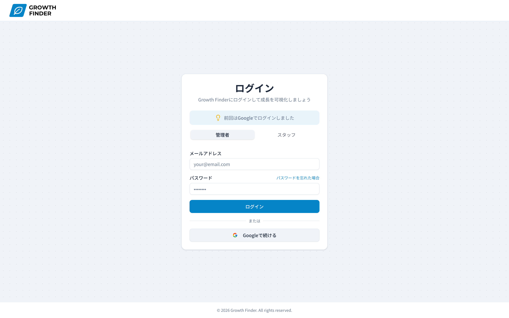

# Growth Finder

> スタッフの成長を可視化し、店長とスタッフの関係性構築を支援する人材育成ツール

[](https://nextjs.org/)
[](https://www.typescriptlang.org/)
[](https://supabase.com/)
[](https://vercel.com/)


**デモサイト**: [https://growth-finder-psi.vercel.app/](https://growth-finder-psi.vercel.app/)

https://github.com/user-attachments/assets/7048cab6-717d-4a6a-a735-e344a159e431

---

## デモを試す

デモアカウントの登録は不要です。ファーストビューの **「デモで今すぐ試す」** ボタンから、
ワンクリックでアプリの全機能を体験できます。

**デモサイト**: https://growth-finder-psi.vercel.app/

> デモ環境では、評価入力・履歴閲覧・ランク算出など主要機能をすべてお試しいただけます。
> アカウント登録なしで、面接・カジュアル面談中にもすぐご確認いただけるよう設計しました。

---

## 目次

- [プロジェクト概要](#プロジェクト概要)
- [開発背景 ― 現場の課題から生まれたアプリ](#開発背景--現場の課題から生まれたアプリ)
- [主な機能](#主な機能)
- [技術スタックと選定理由](#技術スタックと選定理由)
- [システム設計](#システム設計)
- [設計上の試行錯誤](#設計上の試行錯誤)
- [セットアップ方法](#セットアップ方法)
- [開発者について](#開発者について)

---

## プロジェクト概要

**Growth Finder** は、カフェなどの飲食店におけるスタッフ育成を支援する Web アプリケーションです。

カフェ店長として 13 年の現場経験から生まれた「伸びしろ発見チェックシート」をデジタル化し、スタッフの成長を可視化・共有することで、店舗全体のレベル向上と、店長・スタッフ間の信頼関係構築を目指します。

- スタッフの評価をデジタル化し、成長を可視化
- 評価結果を対話の起点にして、関係性構築を支援
- 過去の履歴を一元管理し、店長交代時の引き継ぎも円滑に

---

## 開発背景 ― 現場の課題から生まれたアプリ

### 現場で感じた 3 つの課題

カフェ店長として日々スタッフと向き合う中で、以下の課題を強く感じていました。

1. **スタッフが思うように動いてくれない**
2. **スタッフ自身が「自分の何が成長したのか」を実感しにくい**
3. **1on1 の場で「何を話すか」のきっかけが作りにくい**

### アナログ運用時代

そこで、QHC(Quality / Hospitality / Cleanliness)の評価フレームワークを基に、自分で **「伸びしろ発見チェックシート」** を Excel で作成しました。

- [開発コンセプトスライド](./docs/concept-slides.pdf) ― なぜこのツールを作ったのか
- [伸びしろ発見チェックシート](./docs/growth-finder-sheet.pdf) ― 自作したツール(印刷用)

実際に現場で運用したところ、スタッフとの対話の質が大きく変わりました。
**「店長から見た自分」と「自分が思う自分」のギャップを認識することで、スタッフ自身が成長の方向性を自覚できる**ようになりました。

### アナログ運用の限界

しかし運用を続けるうちに、新たな課題が見えてきました。

| 課題                           | 具体例                                             |
| ------------------------------ | -------------------------------------------------- |
| **データの一元管理が困難**     | スタッフ毎の紙シートが店舗に散らばる               |
| **履歴の参照に時間がかかる**   | 「3 ヶ月前の評価どうだったっけ？」がすぐ見られない |
| **店長交代時の引き継ぎが煩雑** | 紙束を渡しても、評価の文脈までは伝わらない         |
| **集計・可視化ができない**     | スタッフ全体の傾向や、本人の成長曲線が見えない     |

この課題を解決するため、**Excel で作ったツールを Web アプリケーション化**することにしました。これが Growth Finder です。

> **このプロジェクトの本質**
> 単なる評価システムではなく、「**店長とスタッフの関係性を構築し、信頼の土台を作るためのツール**」として設計しています。

---

## 主な機能

### 注目機能

このアプリのコアとなる機能を実装の意図とともに紹介します。

#### 1. 評価入力フォーム

ネストタブ UI で、４カテゴリ ×3 観点を直感的に評価できます。
現場で店長がスマートフォンで入力するシーンを想定し、評価ボタンを横並びに配置するなど、モバイルでの操作性・タップのしやすさにこだわって設計しました。
タブを切り替えても入力データは保持される設計です。

https://github.com/user-attachments/assets/9fb44b26-97fc-4050-8c9a-cf192c3c62ea


#### 2. 各項目には良かった点・もっと良くなる点をモーダルでコメント記録

思ったことを鮮度の良い状態で記録できたほうがいいので、右下に追随するボタンを配置。  
モーダルが開き瞬時にコメントを残すことが出来ます。


#### 3. サマリー・自動ランク算出

評価点から自動でランクを算出。アクションプランや 3 ヶ月後の未来まで記録できる  
 **「対話のためのツール」** としての設計です。


#### 4. スタッフ管理

スタッフの追加・検索・現状の評価状態を一覧で確認できます。


### 機能一覧

#### 認証・権限管理

- ユーザー登録・ログイン機能(Supabase Auth)
  - メールアドレス + パスワード認証
  - Google OAuth
  - メール確認・パスワードリセット
- ロールベースアクセス制御(管理者/スタッフ)
- ルート保護(Next.js Middleware)

#### スタッフ管理

- スタッフ一覧表示
- スタッフ追加・編集・削除(CRUD)
- スタッフ検索機能

#### 評価機能

- 評価入力フォーム(react-hook-form + Zod)
  - ネストタブ UI(4 カテゴリ × 3 観点)
  - タブ切替時の入力データ保持
- フィードバックコメント機能
  - 良かった点の記録
  - もっと良くなる点の記録
- 下書き保存機能(draft / completed ステータス管理)
- 評価期間管理

#### 集計・可視化

- 総合ランク自動算出
- カテゴリ別達成率の自動計算
- スキルグラフ(Recharts レーダーチャート)
- 達成率ドーナツチャート(Recharts)

#### 育成支援

- アクションプラン記録
- 総括コメント記録
- 3 ヶ月後の未来(目標)記録

#### UI / UX

- レスポンシブ対応(モバイル / PC)
- shadcn/ui によるコンポーネント設計

#### テスト・品質

- ESLint(静的解析)
- Vitest(単体テスト)
- GitHub Actions(CI/CD)

#### インフラ

- Vercel(ホスティング)
- Supabase(BaaS / PostgreSQL)
- Docker(ローカル開発環境)

---

## 技術スタックと選定理由

「なぜそれを選んだか」を意識して技術選定を行いました。

本アプリは業務ツールであり SEO 対策が不要なため、SPA(Single Page Application)での開発も検討しました。最終的に Next.js を採用したのは、以下 2 つの理由からです。

1. **ロールベースのルーティングが複雑になるため**
   管理者とスタッフの 2 種類のロールがあり、それぞれで遷移できる画面が異なります。App Router のファイルベースルーティングと middleware で、ルート保護とロール判定を一箇所で管理できます。

2. **セキュリティと UX を両立させたかったため**
   評価の登録・更新といった機密性の高いデータのロジックは Server Actions でサーバー側に集約し、画面遷移は SPA のように滑らかな UX を保ちたいと考えました。Server Components と Server Actions の組み合わせで、この両立が実現できます。

技術選定の詳細は以下の通りです。

### フロントエンド

| 技術                         | 選定理由                                                                                                                                                                                                  |
| ---------------------------- | --------------------------------------------------------------------------------------------------------------------------------------------------------------------------------------------------------- |
| **Next.js 15 (App Router)**  | Server Components/Server Actions による「責務の分離」の徹底させるため使用しました。本アプリでは「評価」という不正があってはならないデータを扱うため、更新ロジックを Server Actions に集約し隠蔽しました。 |
| **TypeScript**               | 評価項目・ランク算出など、ドメインロジックの型安全性が必須になります。`SectionType = 'basic' \| 'barista' \| 'cashier` のような Union 型で状態を表現することで、バグを未然に防いでいます。                |
| **React 19**                 | Server Components と `use()` API による非同期データ受け渡しなど、最新パターンを学習・実践するため導入しました。                                                                                           |
| **Tailwind CSS + shadcn/ui** | デザインシステムを自作する工数を削減しつつ、コンポーネントを自分のリポジトリで管理できる柔軟性が魅力であるため導入しました。                                                                              |
| **react-hook-form + Zod**    | フォーム状態の管理と、サーバー/クライアント両方で同じスキーマを使えるバリデーション設計で扱いやすいので採用しました。                                                                                     |
| **Recharts**                 | スタッフの成長曲線を可視化するためです。React との統合がスムーズ なので導入しました。                                                                                                                     |

### バックエンド

| 技術           | 選定理由                                                                                                                                     |
| -------------- | -------------------------------------------------------------------------------------------------------------------------------------------- |
| **Supabase**   | PostgreSQL ベースで、認証・DB・Row Level Security が一体化している。個人開発のスピード感と、本格的な DB 設計の両立が可能なため採用しました。 |
| **PostgreSQL** | 評価データの複雑なリレーション（3 層構造の正規化）を厳格に管理し、データの整合性を担保するのに RDB が最適だと判断したためです。              |

### 開発環境・インフラ

| 技術                | 選定理由                                                                                          |
| ------------------- | ------------------------------------------------------------------------------------------------- |
| **Vercel**          | Next.js との親和性が高いため選択しました。                                                        |
| **Docker**          | ローカル環境の再現性確保のため。Linux/Docker 基礎を Ubuntu コンテナで学習した経験を活用しました。 |
| **GitHub Actions**  | PR 作成時に自動で Lint/Test を走らせ、品質担保。ブランチ保護ルールと組み合わせて運用しています。  |
| **ESLint / Vitest** | 静的解析・単体テスト 2 層で品質を担保する設計にしました。                                         |

---

## システム設計

### アーキテクチャ図


### データベース設計(ER 図)


**設計のポイント:**

- `evaluations` (評価本体) → `evaluation_sections` (カテゴリ単位) → `evaluation_items` (項目単位) の 3 層構造で正規化
- 良かった点・改善点は `evaluation_sections` 上に `TEXT[]` (配列型)で保持し、可変長コメントに対応
- `(staff_id, evaluation_date)` に UNIQUE 制約 + upsert で、同日の重複登録を防止

### 画面遷移図


---

## 設計上の試行錯誤

### 1. DB 層とフォーム層の境界での型整形

**背景:2 つの構造をもつデータ**
評価入力画面では、Supabase から既存の評価データを取得し、react-hook-form の `defaultValues` に渡します。ただし、DB の構造とフォームの構造は形が違う。

**DB の構造のコード(.select の３階層のネスト)**

```typescript
.select(
  `
    id,
    status,
    action_plan,
    total_comment,
    future_vision,
    evaluation_sections (
      id,
      section_type,
      good_points,
      improvement_points,
      skill_score,
      skill_max,
      hospitality_score,
      hospitality_max,
      cleanliness_score,
      cleanliness_max,
      evaluation_items (
        item_name,
        category,
        score
      )
    )
  `
)
```

**フォームの構造のコード(basic/barista/cashier をキーに持つオブジェクト)**

```typescript
{
    basic: {
      skill: {},
      hospitality: {},
      cleanliness: {},
      good_points: [],
      improvement_points: [],
    },
    barista: {
      skill: {},
      hospitality: {},
      cleanliness: {},
      good_points: [],
      improvement_points: [],
    },
    cashier: {
      skill: {},
      hospitality: {},
      cleanliness: {},
      good_points: [],
      improvement_points: [],
    },
    action_plan: '',
    total_comment: '',
    future_vision: '',
  }
```

**なぜ形を揃えなかったのか**
両者を一致させるためには DB 側の構造を変更するか、フォーム側を配列構造にするかの２択になります。  
しかしフォーム側を配列にすると、以下のデメリットがあります。

- 配列の 0 番目は basic、という暗黙のルールが生まれます。
- setValue 時のパスを`sections.0.skill.xxx`のようにインデックスで指定する必要があります。

特に２点目は、評価項目コンポーネント`EvaluationItem`で問題になります。このコンポーネントは複数のカテゴリ・複数の項目を共通ロジックで扱うため、`setValue`のパスをテンプレートリテラルで動的に組み立てます。

```typescript
setValue(`${sectionType}.${category}.${item_name}`, score);
```

オブジェクト構造であれば`sectionType = 'basic' | 'barista' | 'cashier'`をそのままパスに使えます。一方、配列構造だと「basic は 0 番目、barista は 1 番目...」というマッピングをコンポーネント側で持たないといけなくなり、コードが複雑になります。

DB の構造は DB の都合、フォームの構造は UI の都合です。
それぞれの都合に合わせた形を持ち、境界で整形するようにしました。

**最初の実装と違和感**
当初は reduce の初期値に空オブジェクト`{}`を渡し、それを`as FormattedEvaluation`で目的の型を主張する形で実装していました。動作はしていましたが、TypeScript の学習を進める中で、`as`キャストが型チェックを黙らせる手段でしかないことを理解しました。  
このコードでは初期値の`{}`を「`FormattedEvaluation`だ」と強引に主張しているだけで、実際に`basic`/`barista`/`cashier`のプロパティが揃っているかは保証されません。  
`reduce`の処理の中でプロパティが追加される前提に依存しており、もし処理に不備があっても型エラーで気が付けない状態でした。

```typescript
const result = existingEvaluation.evaluation_sections.reduce((acc, cur) => {
  acc[cur.section_type] = {
    ...formatCategoryScores(cur.evaluation_items),
    good_points: (cur.good_points ?? []) as string[],
    improvement_points: (cur.improvement_points ?? []) as string[],
  };
  return acc;
}, {} as FormattedEvaluation);
```

**書き直した実装**
reduce にジェネリクス型引数を渡し、返り値の型を宣言しました。  
初期値も EMPTY_SECTION_DATA で必須プロパティを揃え、型と実体を一致させました。

```typescript
const EMPTY_SECTION_DATA: SectionData = {
  skill: {},
  hospitality: {},
  cleanliness: {},
  good_points: [],
  improvement_points: [],
};

export const formatEvaluationData = (
  existingEvaluation: ExistingEvaluation
) => {
  const result =
    existingEvaluation.evaluation_sections.reduce<FormattedEvaluation>(
      (acc, cur) => {
        acc[cur.section_type] = {
          ...formatCategoryScores(cur.evaluation_items),
          good_points: cur.good_points ?? [],
          improvement_points: cur.improvement_points ?? [],
        };
        return acc;
      },
      {
        basic: {
          ...EMPTY_SECTION_DATA,
        },
        barista: {
          ...EMPTY_SECTION_DATA,
        },
        cashier: {
          ...EMPTY_SECTION_DATA,
        },
      }
    );

  return result;
};
```

**もう一つの型崩れ：Supabase の自動生成型の限界**
Supabase は select の結果から型を自動生成しますが、
DB の CHECK 制約までは型に反映されません。
例えば、`evaluation_sections.section_type` は DB 側で `CHECK('basic', 'cashier', 'barista')`制約はありますが、返却される型は `string`になります。アプリケーション側で `SectionType = 'basic' | 'cashier' | 'barista'`を定義し、整形時に型を絞る必要がありました。

**設計判断としての学び**

- DB の構造とアプリケーションのデータ構造は無理に一致させる必要はありません
- 両者の境界で整形することで、DB を変えずにアプリケーションの都合に合わせられます
- DB の自動生成型は万能ではない。CHECK 制約のような情報は失われるため、必要に応じてアプリケーション側で型を絞り直す判断が必要です

### 2. 認証フローの設計 - 1 つのログイン画面で 2 種類のロールを安全に扱う

**背景:管理者と一般スタッフが共存するアプリ**
本アプリのロールは`admin`と`staff`の 2 種類あります。
ログイン画面は 1 つで、管理者・スタッフのタブを切り替えることで表示されるフォームが切り替わる構成です。Google OAuth ボタンは管理者タブにのみ表示しています。



**最初の実装と気づき**

スタッフのルーティングをチェックしていたとき、スタッフが管理者になりすまして管理者アカウントを作成できる状態であることに気づきました。

管理者タブの「Google で続ける」ボタンは `signUpWithGoogle` を呼び出し、`role: 'admin'` を `user_metadata` に含める実装になっていました。そのため、スタッフが管理者タブで Google OAuth を実行すると、新規 admin として`profiles` レコードが作られ、`/admin` にアクセスできる状態でした。

**検討した選択肢**
問題の解決策として、2 つの方向性を検討しました。

### 選択肢 1: 管理者用ログインとスタッフ用ログインの 2 種類用意する

`/admin-login`・`/staff-login`のような URL を作り、物理的にスタッフが管理者の Google OAuth ボタンを押せなくすることを検討しました。しかしいくつか問題があり採用には至りませんでした。
採用しなかった理由は以下の通りです。

- 管理者がスタッフに案内する URL が複数存在するため、混乱を招きます
- 誤って管理者用ログイン URL をスタッフに伝えてしまうと URL 秘匿に依存していた防御線が崩れます

特に 2 番目は実際に起こりうるリスクです。URL の秘匿に頼る設計は運用ミス 1 回で致命傷になりかねません。

### 選択肢 2: 認証ロジックで OAuth フローの意図を判別する(採用)

ログイン画面は 1 つのままで、OAuth のリダイレクト URL に「ログイン目的なのかサインアップ目的なのか」を示すパラメータ(`intent`)を付与します。OAuth callback 側でその`intent`と`profiles`のデータを照合することで不正なフローを弾く設計です。

この方針を採用した理由は以下の通りです。

- 運用面:ログイン画面が 1 つでスタッフに URL を伝える際の混乱がありません
- セキュリティ面:URL 秘匿に依存しないため、伝え間違いなどの運用ミスに強くなります
- 実装面:管理者・スタッフのログイン画面を共有できるためコードの記述量が抑えられます

**採用した設計:intent パラメータによるフロー判別と既存フラグの活用**

本アプリには、もともと OAuth 認証時に２つの仕組みが存在していました。

1. **intent パラメータ**: OAuth callback で「ログインなのかサインアップなのか」を判定し、遷移先を分岐するために導入したクエリパラメータです(`intent=login` → `/admin`、`intent=signup` → `/setup`)。

2. **is_setup_complete フラグ**: OAuth でアカウントを作成した直後のセットアップ未完了を表現するフラグです。名前や店舗名などが未入力の状態で、管理者アカウントとして不完全な状態を示します。

これらは、いずれももともと UX 向上のために実装した機能です。OAuth 認証ではメールアドレスしか取得できないため、名前や店舗名を別途入力させる必要があります。intent と is_setup_complete を組み合わせることで、ログイン直後にセットアップ画面へ自動的に誘導し、ユーザーにプロフィール設定の手間を取らせない設計にしていました。

**今回の問題への適用**

スタッフが管理者になりすましてアカウントを作成できる脆弱性に対して、新しい仕組みを作るのではなく、既存の`intent`と`is_setup_complete`を組み合わせて検証する形で解決しました。

具体的には callback で`intent === 'login'`の分岐に、`profile.role === 'admin'`かつ`profile.is_setup_complete === true`の検証を追加し解決しました。

```typescript
// ...(profile 取得など)

if (intent === 'login') {
  const isValidAdmin =
    profile.role === 'admin' && profile.is_setup_complete === true;

  if (!profile.is_setup_complete) {
    return; // セットアップ未完了はブロック
  }

  if (!isValidAdmin) {
    return; // 管理者以外はブロック
  }

  return; // /admin へ
}

if (intent === 'signup') {
  if (profile.is_setup_complete) {
    return; // 既存ユーザーは /admin へ
  }
  return; // セットアップ未完了ユーザーは /setup へ
}

return; // intent が無い場合は /login へ
```

**intent ごとの動作**

- intent === 'login': 既存の admin かつセットアップ完了済みのときのみ /admin へ
- intent === 'signup': 新規は /setup へ、セットアップ完了済みなら /admin へ
- intent が無い場合: 想定外のフローなので /login へ

この分岐の検証により、スタッフが管理者タブから OAuth 認証しても、`intent === 'login'`分岐で弾かれます。既存の仕組みに検証ロジックを追加するだけで、URL 秘匿に依存しない防御を実装することができました。

**設計の限界としての判断:スタッフのアカウント発行**

セキュリティの観点からは、スタッフが自分でアカウントを作成する形が望ましいです。しかし現場には「アカウントを作成しておいてください」と案内をしても、やらない人が一定数います。評価したいときにスタッフのアカウントが無いとスケジュールが狂ったりして業務に支障をきたします。

そのため、スタッフのアカウントは管理者が代理で発行する設計にしました。セキュリティの理想を追求して扱いづらい設計より、現場で確実に運用される設計を選びました。

ただし、この運用には弱点があります。管理者がスタッフのパスワードを知っている状態であり、スタッフが自分でパスワードを変更しない限り、その状態が続きます。本来なら初回ログイン時にパスワード変更を促す仕組みが望ましいので、将来的には改善していきたいです。

**設計判断としての学び**

- URL の秘匿性に頼る設計は、1 回の運用ミスで致命傷になるので認証ロジックでの判別の方が運用に強い
- 新しい機能を実装するときは、既存の仕組みを再利用できないか考えることで、実装コストを下げることができる
- セキュリティの理想と現場での運用の現実を理解して、落としどころを決め設計すること

---

## 開発者について

### 柳澤武志 (Takeshi Yanagisawa)

カフェ店長として 13 年の現場経験を持つ、フロントエンドエンジニア志望者です。
2024 年 11 月にプログラミング学習を開始し、表面的な書き方ではなく根本原理の理解を重視して学んでいます。

### リンク

- **GitHub**: [@takeshi0518](https://github.com/takeshi0518)
- **Zenn**: [技術記事一覧](https://zenn.dev/takeshi0518)
- **X (Twitter)**: [@y_takeshi0518](https://x.com/y_takeshi0518)

### このプロジェクトを通じて伝えたいこと

> **「現場の課題を、技術で解決する」**
>
> エンジニアリングは目的ではなく手段です。
> 13 年の現場経験で見つけた課題を、自分の手で解決していくプロセスそのものが、私のエンジニアとしての価値だと考えています。

---

## ライセンス

このプロジェクトは個人のポートフォリオ用途として作成されています。
