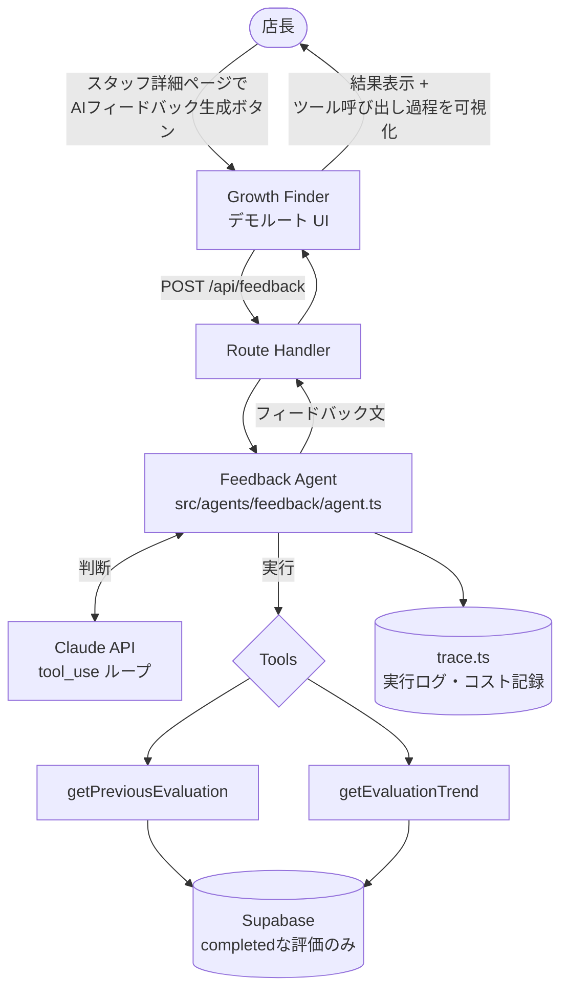

# Growth Finder AI — 1on1 フィードバック生成エージェント

> RAYVEN 技術課題 v2 提出物。既存プロダクト [Growth Finder](#) への機能追加として実装。

## 目次

- [Growth Finder AI — 1on1 フィードバック生成エージェント](#growth-finder-ai--1on1-フィードバック生成エージェント)
  - [目次](#目次)
  - [何をするエージェントか](#何をするエージェントか)
    - [なぜこの設計か](#なぜこの設計か)
  - [想定ユーザーと業務シナリオ](#想定ユーザーと業務シナリオ)
  - [想定される効果](#想定される効果)
    - [なぜ AI を導入するのか](#なぜ-ai-を導入するのか)
  - [セットアップ手順](#セットアップ手順)
  - [必要な環境変数](#必要な環境変数)
  - [実行方法](#実行方法)
  - [アーキテクチャ](#アーキテクチャ)
    - [モジュール構成](#モジュール構成)
    - [エージェントループ](#エージェントループ)
  - [使用した LLM API と選定理由](#使用した-llm-api-と選定理由)
    - [選定理由](#選定理由)
    - [モデル変更時に影響を受ける箇所](#モデル変更時に影響を受ける箇所)
    - [API キーの設定方法](#api-キーの設定方法)
    - [利用料金を抑えるための工夫](#利用料金を抑えるための工夫)
  - [ツール一覧](#ツール一覧)
  - [うまくいく入力例 / 苦手な入力例](#うまくいく入力例--苦手な入力例)
  - [エラーハンドリング方針](#エラーハンドリング方針)
  - [実務投入するなら次に改善すること](#実務投入するなら次に改善すること)

---

## 何をするエージェントか

店長がスタッフに行った QHC 評価をもとに、**1on1 面談用のフィードバックを自動生成する AI エージェント**です。

このエージェントは、与えられた評価をただ文章化するのではなく、**自ら過去の評価履歴を取得・比較した上で**フィードバックを生成します。これは「LLM を 1 回呼ぶ API」ではなく、判断とツール呼び出しを反復する**エージェントループ**として実装しています。

### なぜこの設計か

Growth Finder のプロダクト哲学は「成長を可視化し、過去と比較して伸びた点を承認し、モチベーションを高める」ことです。承認するには過去との比較が不可欠であり、そのため過去履歴の取得はエージェントにとって後付けの機能ではなく、**機能要件そのもの**です。

役割分担は明確に分離しています。

| 担い手           | 役割                                                     |
| ---------------- | -------------------------------------------------------- |
| 店長（人）       | QHC 評価・コメントの入力（評価そのものは AI に任せない） |
| ツール（コード） | 過去の completed 評価を客観的事実として取得（read-only） |
| LLM              | 差分を読み取り、承認の言葉に変換する（評価はしない）     |

---

## 想定ユーザーと業務シナリオ

**想定ユーザー**: カフェ店長（約 30 名のスタッフを管理する店舗を想定）

**業務シナリオ**:

```
店長がスタッフを選択
  → QHC評価を入力 / コメント入力
  → 「AIフィードバック生成」ボタンを押下
  → エージェントが起動し、過去評価を参照しながらフィードバックを生成
  → 店長が内容を確認
  → 1on1面談で活用
```

店長がフィードバック文を書く時間を、スタッフとの対話に振り向けることを目的としています。

---

## 想定される効果

13 年間のカフェ店長経験に基づく実感値として、スタッフ 1 名分のフィードバックを整理・文章化する作業には最低でも 5 分程度かかる。QHC 評価の入力自体は店長が担うべき重要な工程であり時間がかかって当然だが、そのあとの「評価内容を振り返り、文章としてまとめる」総括作業が負担になっている。

30 名のスタッフを抱える店舗を想定した場合の試算は以下の通り。

|                                  | 1 人あたり        | 30 名  |
| -------------------------------- | ----------------- | ------ |
| 導入前（手動で総括）             | 約 5 分（300 秒） | 150 分 |
| 導入後（エージェント生成＋確認） | 約 1 分（60 秒）※ | 30 分  |

※ フィードバック生成自体は約 30 秒を見込むが、スタッフ選択などの操作時間を加味して 1 人あたり 60 秒として試算。この数値はまだ実測値ではなく、実装後に`trace.ts`で記録するレイテンシログをもとに実測値へ更新する予定。

試算上、**約 120 分（2 時間）の業務削減**が見込める。これは店長が文章作成に充てていた時間を、スタッフとの対話そのものに振り向けられることを意味する。

削減時間に加えて、質的な効果もある。エージェントが `getEvaluationTrend` で QHC それぞれの傾向を機械的に算出するため、たとえば「接客は伸びているが清掃だけ下降傾向」のように、評価入力の最中には店長自身が意識していないパターンが可視化される。フィードバックの自動化は単なる時短ではなく、**評価を客観視する新たな視点**を店長に提供する効果もあると考えている。

### なぜ AI を導入するのか

削減した 120 分を何に使うかは、最終的には店長の裁量である。しかし個人的には、**AI に代替できない仕事に再投資すること**に最も価値があると考えている。それは、スタッフとの直接的なコミュニケーションである。

フィードバックの文章化は AI に任せられる。しかし、そのフィードバックを表情や反応を見ながら伝え、対話を通じてモチベーションを引き出すという「人の管理」そのものは、AI には代替できない。だからこそ、AI によって生まれた時間を人の管理に再投資することに意味がある。

定型的な作業を AI が担うようになるほど、AI に代替できない「人の管理」の価値は相対的に高まっていく。このエージェントは、店長の作業を単に減らすためではなく、店長にしかできない仕事に時間を再配分するために設計している。

---

## セットアップ手順

> 本エージェントは既存の Growth Finder リポジトリに機能追加する形で実装しています。以下は本機能に関わるセットアップです（既存アプリ自体のセットアップ手順は本体 README を参照してください）。

```bash
# 1. リポジトリをクローン（既存 Growth Finder）
git clone <growth-finder-repo-url>
cd growth-finder

# 2. 依存パッケージをインストール
npm install

# 3. 環境変数を設定
cp .env.example .env.local
# .env.local に必要な値を記入（次項参照）

# 4. 開発サーバーを起動
npm run dev
```

デモルート（認証不要）から、任意のスタッフに対して AI フィードバック生成を試せます。

---

## 必要な環境変数

```env
# LLM API
ANTHROPIC_API_KEY=your_api_key_here
AGENT_MODEL=claude-sonnet-4-6      # コストを抑えたい場合は claude-haiku-4-5 に切替可能

# Supabase
NEXT_PUBLIC_SUPABASE_URL=your_supabase_url
NEXT_PUBLIC_SUPABASE_ANON_KEY=your_anon_key
SUPABASE_SERVICE_ROLE_KEY=your_service_role_key   # サーバー側のツール実行でのみ使用
```

`ANTHROPIC_API_KEY` および `SUPABASE_SERVICE_ROLE_KEY` はリポジトリに含めず、`.gitignore` 対象の `.env.local` で管理します。

---

## 実行方法

1. `npm run dev` で開発サーバーを起動
2. デモルートにアクセスし、評価履歴のあるスタッフを選択
3. スタッフ詳細ページの「AI フィードバック生成」ボタンを押下
4. エージェントがツールを呼び出す様子（過去評価の参照・比較）がトレースとして表示された後、フィードバックが画面に出力される

---

## アーキテクチャ



### モジュール構成

既存アプリに組み込みつつ、エージェントロジックは独立したモジュールに凝集させています。評価者はエージェントの中身を `src/agents/feedback/` だけ見れば把握できます。

```
src/
  agents/
    feedback/
      agent.ts    ← エージェントループ本体（LLM呼び出し + tool実行の反復）
      tools.ts    ← LLMに渡すツール定義
      prompt.ts   ← システムプロンプト・スキーマ
      trace.ts    ← 実行トレース・コスト記録
  app/
    api/feedback/route.ts    ← agents/feedback を呼ぶ薄いエンドポイント
    (demo)/.../page.tsx      ← デモルート上のボタンUI
```

### エージェントループ

「LLM を 1 回呼ぶ関数」と「エージェント」の違いは、情報取得の判断を誰が握るかです。本実装では LLM 自身が「過去履歴が必要」と判断してツールを呼び、結果を見て次の判断をする反復ループを組んでいます。

```
1. messages に現在の状態を入れて LLM を呼ぶ
2. LLM の返答を見る
   - tool_use が含まれる → ツールを実行し、結果を messages に追加して 1 へ戻る
   - tool_use がない（テキストのみ） → それが最終成果物。ループ終了
   - iterations が maxIterations（5）に達した → 打ち切り
```

終了理由は型で明示しています。

```typescript
type AgentResult =
  | { status: 'completed'; feedback: string; trace: ToolCallLog[] }
  | { status: 'max_iterations'; trace: ToolCallLog[] }
  | { status: 'error'; error: string; trace: ToolCallLog[] };
```

---

## 使用した LLM API と選定理由

**選定: Anthropic Claude API**（モデル: Sonnet 系をデフォルト、環境変数で Haiku 系に切替可）

### 選定理由

- 今回の設計の核は LLM 自身が複数回ツールを呼ぶエージェントループであり、Anthropic はこの「単発のツール呼び出しから本番運用レベルのエージェントループまで」を前提にしたドキュメント体系を持っており、設計方針との親和性が高い。
- OpenAI も Function Calling や豊富なホスト型ツール（Web 検索・コード実行等）を持つが、本エージェントが使うのは自作の読み取り専用ツール（Supabase 参照）のみであり、ホスト型ツールの広さは活きない。カスタムツールを定義してループを回す、という核となる仕組みは両社でほぼ同等。
- 今回の利用規模（店長 1 名・スタッフ約 30 名、面談ごとに数回呼び出し）ではプロバイダー間のコスト差は実質無視できる水準。決め手は価格ではなく、エージェントループの実装しやすさと、ドキュメントの一貫性。

### モデル変更時に影響を受ける箇所

- `AGENT_MODEL` 環境変数の値
- `prompt.ts` のシステムプロンプトの書きぶり（モデルによってツール呼び出しをどの程度積極的に行うかの傾向が異なるため、再調整が必要になる場合がある）
- `trace.ts` のコスト計算ロジック（モデルごとの料金レートを参照しているため）

### API キーの設定方法

`.env.local` に `ANTHROPIC_API_KEY` を設定。リポジトリには含めない。

### 利用料金を抑えるための工夫

- `maxIterations = 5` の上限でツール呼び出しの暴走・無限ループを防止
- 過去評価は全件をそのまま LLM に渡さず、**コード側（DB 集計）で要約してから渡す**（`getEvaluationTrend`）。これにより在籍期間の長さとトークン消費量が比例しない
- `completed` な評価のみを対象とし、`draft` の評価を無駄に読み込まない
- コストを重視する場合は `AGENT_MODEL` を Haiku 系モデルに切り替え可能な構成にしている

---

## ツール一覧

いずれも **read-only**（データの書き込みは行わない）。評価そのものを書き換える権限を AI に持たせないという設計判断による。

| ツール名                         | 役割                                                                                                                                                                                                                              |
| -------------------------------- | --------------------------------------------------------------------------------------------------------------------------------------------------------------------------------------------------------------------------------- |
| `getPreviousEvaluation(staffId)` | 直近の completed 評価 1 件を取得。前回比較の具体的な材料になる。                                                                                                                                                                  |
| `getEvaluationTrend(staffId)`    | 全 completed 評価をコード側で集計し、QHC それぞれの全期間平均と傾向（`improving` / `stable` / `declining`）を返す。傾向判定は「直近 3 件平均 vs それ以前平均」を共通閾値で比較し、データが 4 件未満の場合は `stable` 扱いとする。 |

数値の集計・傾向判定はコード側（ルールベース）で行い、LLM には計算をさせない方針とした。理由はコスト抑制に加え、LLM に数値計算を任せると不正確になりうるため。LLM は集計結果の**解釈と言葉選び**に専念する。

---

## うまくいく入力例 / 苦手な入力例

**うまくいく例**: completed 評価が複数回蓄積されているスタッフ。経時比較の材料が十分にあり、「直近で接客が伸びた」「入社以来着実に上昇傾向」のような具体的な承認コメントを生成できる。

**苦手な例**: 評価が 1 件のみの新人スタッフ。`getEvaluationTrend` はデータ不足のため `stable` 固定を返し、比較に基づく承認コメントは薄くなる。この場合エージェントは「比較材料がまだ少ない」ことを踏まえた正直なフィードバックを返す設計とし、存在しない成長を捏造しないようにしている。

---

## エラーハンドリング方針

- ツールの実行結果は成功/失敗のユニオン型（`ToolResult`）で表現し、空結果や失敗も例外で落とさず LLM に返す。LLM はそれを踏まえた回答を生成できる。
- `maxIterations` の上限でツール呼び出しの暴走を防止し、`AgentResult` の `status` で正常終了・上限打ち切り・エラーを呼び出し側が型で判別できるようにしている。
- Supabase 接続失敗時は `{ ok: false, error: ... }` を返し、LLM に「情報が取得できなかった」ことを伝えた上での回答を促す。

---

## 実務投入するなら次に改善すること

- **`getTeamAverage` ツールの追加**: 絶対評価だけでなく、同時期の他スタッフとの相対的な立ち位置も承認材料になりうる。今回はスコープを絞るため見送った。
- **ツール呼び出しの並列化**: `getPreviousEvaluation` と `getEvaluationTrend` は互いに独立しているため `Promise.all` で並列実行できる。まずは順次実行で正しく動くことを優先し、並列化は次のステップとした。
- **Tumiki（MCP プロキシ）を用いたエージェント行動の監査ログ化**: 自作ツールを MCP サーバーとして切り出し、RAYVEN 自身のプロダクトである Tumiki のプロキシ経由でエージェントの行動（どのツールをいつ呼んだか）を監査ログとして記録する構成が考えられる。Tumiki が目指す「AI エージェントの通信を統制・可視化する」という思想と、本エージェントの設計方針（read-only ツールに限定し、AI に評価をさせない）は方向性が一致しており、自然な拡張だと考えている。今回は 1 週間のスコープの都合で見送ったが、実務投入する際の次のステップとして有力な選択肢。
