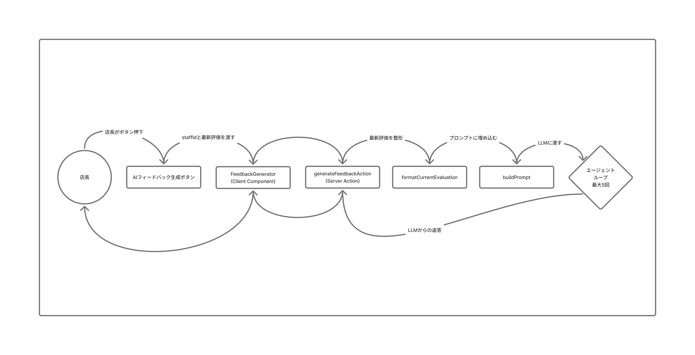
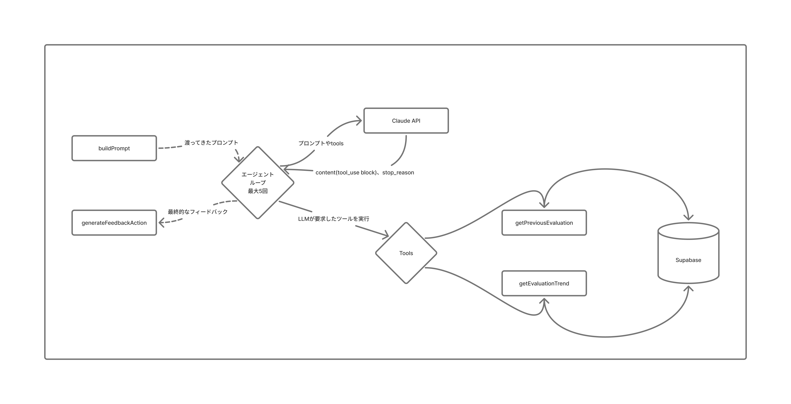

# 株式会社 RAYVEN 技術課題デモ

柳澤武志
2026 年 7 月 23 日(木)

---

## 技術課題の概要

Growth Finder とはスタッフの評価・育成アプリです
スキル / ホスピタリティ / クリンリネスの３軸で評価を記録・可視化させます

この Growth Finder に、AI フィードバック生成エージェントを追加実装

- 店長がボタンを押すと、スタッフの評価データをもとに 1on1 面談用のフィードバックを生成
- LLM が自分でツールを呼び、過去評価と比較・要約
- 生成物は店長が確認してから面談で使う(人間の承認を挟む)

構成: 既存の本番アプリ(Next.js / Supabase)への機能追加

---

## 解決する業務課題

**店長が、スタッフと向き合う時間を取り戻す**

向き合う = 表情を見て承認の言葉をかけ、意欲に変えること

しかし、その手前の準備が重い

- 評価は付ける。だが要約は手作業
- 過去比較は、昔の資料を引っ張り出して並べる
- 30 名分でやる気が尽き、1on1 が後回しになる

→ AI が下ごしらえ（台本づくり）を担う
→ 店長は、AI にできない仕事に集中できる ＝ 表情を見て、承認の言葉をかけ、意欲を引き出すこと

---

## AI エージェントデモ

これから実際の画面でお見せします

ポイント

- ボタン一つで、過去評価をもとにフィードバックが生成される
- 裏で複数回のツール呼び出しが走っている
- 生成物は店長が確認してから使う

---

## アーキテクチャ ① UI からエージェント起動まで

---

## アーキテクチャ ② エージェントループの中身

---

## 技術選定

### 選定

Anthropic Claude API(claude-haiku-4-5)

### 目的

店長の評価データ → 読みやすいフィードバック → 1on1 面談の土台

### 選定理由

- エージェントループの実装しやすさ・ドキュメントの一貫性
- Haiku: 「評価を承認の言葉に変換」= 高度な推論は不要

---

## 工夫した点

**LLM に「判断」させず、「整形」だけを任せた**
評価するのは店長。LLM はそれを面談の言葉に変換するだけ

1. 計算はすべてアプリケーション層
2. ツールは read-only
3. 対象データは LLM に選ばせない

↓ なぜ LLM の裁量を絞るのか

- 評価に必要なのは、データ化できない感性・温度・空気感
- そこにいた人間だけが感じ取れる。データを渡せば AI も点は付けられるが、それは別物

→ 判断は店長、整形は LLM

---

## 制約、課題、今後の改善案

1. 生成結果を永続化していない(最優先)
2. data[1]への暗黙依存
3. タイムアウト・リトライ未実装

### 発展

評価データの MCP サーバー化「今伸びているスタッフは？」と聞くだけで、非エンジニアの店長でも扱える

---

## まとめ

### AI に任せられる業務は AI に任せる

それによって生まれた時間を、人にしかできない仕事へ

人にしかできない仕事とは、
その人を直接認め、承認欲求を満たし、
次への意欲に変えること。

---

ご清聴ありがとうございました
質疑応答

GitHub: https://github.com/takeshi0518/growth-finder
