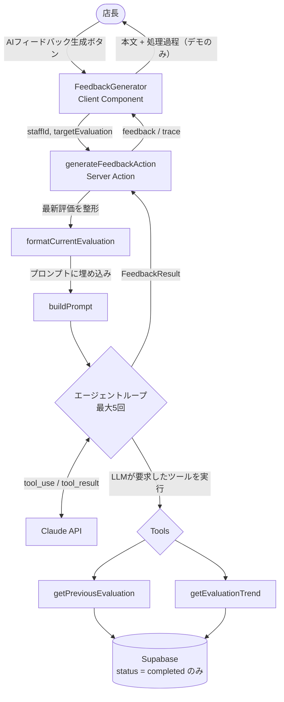

# AI フィードバック生成エージェント

> AI に任せられる業務は AI に任せる。
> その先で生まれた時間を、人にしかできない仕事へ使う。
> 本プロダクトは、店長が入力した QHC 評価をもとに、1on1 面談用のフィードバックを生成する AI エージェントです。
> AI が評価を代替するのではなく、文章作成を支援することで、店長がスタッフとの対話や人材育成により多くの時間を使えるよう設計しました。

> 既存プロダクト [Growth Finder](https://growth-finder-psi.vercel.app) への機能追加として実装。

## 目次

- [AI フィードバック生成エージェント](#ai-フィードバック生成エージェント)
  - [目次](#目次)
  - [何をするエージェントか](#何をするエージェントか)
    - [なぜこの設計か](#なぜこの設計か)
  - [なぜ作ったのか](#なぜ作ったのか)
  - [Growth Finder の評価の仕組み](#growth-finder-の評価の仕組み)
    - [評価軸: QHC](#評価軸-qhc)
    - [セクション: 職務ごとの評価](#セクション-職務ごとの評価)
    - [達成率とランク](#達成率とランク)
    - [評価のサイクルと総括コメント](#評価のサイクルと総括コメント)
  - [想定ユーザーと業務シナリオ](#想定ユーザーと業務シナリオ)
  - [想定される効果](#想定される効果)
    - [AI で時間を生み出し、人にしかできない仕事へ](#ai-で時間を生み出し人にしかできない仕事へ)
  - [セットアップと実行方法](#セットアップと実行方法)
    - [本番環境で試す](#本番環境で試す)
    - [ローカルで動かす](#ローカルで動かす)
  - [必要な環境変数](#必要な環境変数)
  - [アーキテクチャ](#アーキテクチャ)
    - [設計判断: 最新評価はツールで取得しない](#設計判断-最新評価はツールで取得しない)
    - [モジュール構成](#モジュール構成)
    - [エージェントループ](#エージェントループ)
    - [Route Handler ではなく Server Action を採用した理由](#route-handler-ではなく-server-action-を採用した理由)
  - [使用した LLM API と選定理由](#使用した-llm-api-と選定理由)
    - [選定理由](#選定理由)
    - [モデル変更時に影響を受ける箇所](#モデル変更時に影響を受ける箇所)
    - [実測コスト・レイテンシ](#実測コストレイテンシ)
    - [利用料金を抑えるための工夫](#利用料金を抑えるための工夫)
  - [ツール一覧](#ツール一覧)
    - [ツールの引数を持たせない設計](#ツールの引数を持たせない設計)
    - [数値の集計はコード側で行う](#数値の集計はコード側で行う)
  - [うまくいく入力例 / 苦手な入力例](#うまくいく入力例--苦手な入力例)
  - [エラーハンドリング方針](#エラーハンドリング方針)
  - [テスト](#テスト)
    - [テストする範囲としない範囲](#テストする範囲としない範囲)
  - [詰まった点](#詰まった点)
    - [1. AI エージェントとは何かを調べた](#1-ai-エージェントとは何かを調べた)
    - [2. 小さなアプリを作って手で確かめた](#2-小さなアプリを作って手で確かめた)
    - [3. 実際の使われ方をコードリーディングで確認した](#3-実際の使われ方をコードリーディングで確認した)
    - [4. ハルシネーションを目で見て、エージェント化の必然を確認した](#4-ハルシネーションを目で見てエージェント化の必然を確認した)
  - [妥協した点](#妥協した点)
  - [実務投入するなら次に改善すること](#実務投入するなら次に改善すること)
  - [まとめ](#まとめ)

---

## 何をするエージェントか

店長がスタッフに行った QHC 評価をもとに、**1on1 面談用のフィードバックを自動生成する AI エージェント**。
現在の評価だけで文章化するのではなく、必要に応じて過去の評価履歴をツールで取得し、その結果を踏まえてフィードバックを生成する。LLM が自ら情報取得を判断するエージェントループとして実装した。

### なぜこの設計か

Growth Finder のプロダクト哲学は「成長を可視化し、過去と比較して伸びた点を承認し、モチベーションを高める」こと。承認するには過去との比較が不可欠であり、そのため過去履歴の取得はエージェントにとって後付けの機能ではなく、**機能要件そのもの**である。

役割分担は明確に分離している。

| 担い手           | 役割                                                     |
| ---------------- | -------------------------------------------------------- |
| 店長（人）       | QHC 評価・コメントの入力（評価そのものは AI に任せない） |
| ツール（コード） | 過去の completed 評価を客観的事実として取得（read-only） |
| LLM              | 差分を読み取り、承認の言葉に変換する（評価はしない）     |

## なぜ作ったのか

飲食業界は構造的な人員不足にある。人が足りないためにメニュー数を絞り、営業時間を短縮し、
接客や商品の質が落ちる。需要があっても攻めに転じられない。一方で原価は上がり続け、
最低賃金も年々上昇しているため、時給を上げて人を集めるという解決策は現実的でなくなっている。

採用で解決できないなら、**既存のスタッフに長く働いてもらうしかない**。
定着は、もはや人事の話ではなく経営の問題である。

そして定着を左右するのは、店長とスタッフの関係の強さだと考えている。
自分の成長を認めてもらえること、それを言葉で伝えてもらえること。
Growth Finder が「承認によるモチベーション向上」を軸に据えているのは、この認識による。

しかし現実には、店長は評価の総括に時間を取られ、1on1 面談そのものを十分に実施できていない。
本エージェントは、その総括作業を AI に任せることで、店長がスタッフとの対話に時間を使えるようにする。

## Growth Finder の評価の仕組み

本エージェントが扱うデータを理解するために、Growth Finder の評価方式を簡単に説明する。

### 評価軸: QHC

飲食業の現場で用いられる QHC の 3 軸でスタッフを評価する。

| 軸          | 内容                                           | 実装上の名称  |
| ----------- | ---------------------------------------------- | ------------- |
| Quality     | 技術・スキル（ドリンク作成、オペレーション等） | `skill`       |
| Hospitality | 接客・おもてなし（声掛け、気配り等）           | `hospitality` |
| Cleanliness | 清潔さ（清掃、整理整頓等）                     | `cleanliness` |

### セクション: 職務ごとの評価

カフェの職務に応じて、3 つのセクションに分けて評価する。

- **basic**（基本動作）— 挨拶、報連相、後輩への声掛けなど
- **barista** — ドリンク作成、マシン管理など
- **cashier** — レジ対応、商品提案など

各セクションに QHC の 3 軸があるため、**3 セクション × 3 軸 = 9 領域**で評価する。
セクションごとに評価項目数が異なるため、満点も異なる。

### 達成率とランク

各領域はスコアと満点を持ち、合計から達成率（%）を算出する。
セクションごとに満点が異なるため、**比較には達成率（正規化した値）を用いる**。

総合達成率からランクを判定する。

| ランク | 総合達成率 |
| ------ | ---------- |
| A      | 90% 以上   |
| B      | 70% 以上   |
| C      | 50% 以上   |
| D      | 50% 未満   |

### 評価のサイクルと総括コメント

評価は 3 ヶ月に一度行い、1on1 面談で振り返る。面談後の 3 ヶ月は、店長がその内容に沿って指導する。
つまり評価は独立した測定ではなく、**指導サイクルの一部**である。

店長は各セクションの観察を総合して、3 つの総括コメントを記入する。

- **アクションプラン** — 次の 3 ヶ月で取り組むこと
- **総括コメント** — 全体を通しての評価
- **3 ヶ月後の未来** — 次回評価時にどうなっていてほしいか

本エージェントは、これらのスコアと総括コメントを入力として、面談用のフィードバックを生成する。

---

## 想定ユーザーと業務シナリオ

**想定ユーザー**: カフェ店長（約 30 名のスタッフを管理する店舗を想定）

```
店長がスタッフを選択
  → QHC評価を入力 / コメント入力
  → 「AIフィードバックを生成」ボタンを押下
  → エージェントが起動し、過去評価を参照しながらフィードバックを生成
  → 店長が内容を確認
  → 1on1面談で活用
```

チャット UI ではなく、業務フローに沿った**ワンクリック操作**とした。今回必要なのは「AI と会話すること」ではなく「店長の業務時間を短縮すること」であるため。

---

## 想定される効果

13 年間のカフェ店長経験に基づく実感値として、スタッフ 1 名分のフィードバックを整理・文章化する作業には最低でも 5 分程度かかる。QHC 評価の入力自体は店長が担うべき重要な工程だが、そのあとの「評価内容を振り返り、文章としてまとめる」総括作業が負担になっている。

30 名のスタッフを抱える店舗を想定した場合の試算は以下の通り。

|                                  | 1 人あたり        | 30 名  |
| -------------------------------- | ----------------- | ------ |
| 導入前（手動で総括）             | 約 5 分（300 秒） | 150 分 |
| 導入後（エージェント生成＋確認） | 約 30 秒 ※        | 15 分  |

※ 本番環境での実測レイテンシは約 13.5 秒。スタッフ選択などの操作時間を加味して 1 人あたり 30 秒として試算。

試算上、**約 135 分（2 時間 15 分）の業務削減**が見込める。

削減時間に加えて、質的な効果もある。エージェントが `getEvaluationTrend` で QHC それぞれの傾向を機械的に算出するため、評価入力の最中には店長自身が意識していないパターンが可視化される。フィードバックの自動化は単なる時短ではなく、**評価を客観視する新たな視点**を店長に提供する。

### AI で時間を生み出し、人にしかできない仕事へ

削減した時間を何に使うかは、最終的には店長の裁量である。しかし個人的には、**AI に代替できない仕事に再投資すること**に最も価値があると考えている。それは、スタッフとの直接的なコミュニケーションである。

フィードバックの文章化は AI に任せられる。しかし、そのフィードバックを表情や反応を見ながら伝え、対話を通じてモチベーションを引き出すという「人の管理」そのものは、AI には代替できない。定型的な作業を AI が担うようになるほど、AI に代替できない「人の管理」の価値は相対的に高まっていく。

このエージェントは、店長の作業を単に減らすためではなく、店長にしかできない仕事に時間を再配分するために設計している。

---

## セットアップと実行方法

### 本番環境で試す

https://growth-finder-psi.vercel.app

デモルートからログインし、スタッフ詳細ページの「AI フィードバックを生成」ボタンを押すと、
エージェントの動作を確認できます。認証も API キーの用意も不要です。

「AI の処理過程を表示」を開くと、呼び出されたツール・生成コスト・生成時間が確認できます。

https://github.com/user-attachments/assets/9178a6b5-8b21-40e9-9a09-cda8e66f42a6

### ローカルで動かす

コードを手元で動かす場合は Anthropic API キーが必要です。

```bash
# 1. リポジトリをクローン
git clone https://github.com/takeshi0518/growth-finder.git
cd growth-finder

# 2. 依存パッケージをインストール
npm install

# 3. ローカル Supabaseを起動
npx supabase start
# → 表示される API URL と anon key を控えておく

# 4. 環境変数を設定
cp .env.example .env.local
# ANTHROPIC_API_KEY と、上記の API URL / anon key を記入

# 5. マイグレーションとデモデータを投入
npm run db:reset   # migration + seed.sql + 型生成

# 6. 開発サーバーを起動
npm run dev
```

---

## 必要な環境変数

本エージェントが使用するのは以下の 3 つ。

```env
# LLM API（本エージェントで追加）
ANTHROPIC_API_KEY=your_api_key_here

# Supabase（既存 / ツールからの評価データ取得に使用）
NEXT_PUBLIC_SUPABASE_URL=your_supabase_url
NEXT_PUBLIC_SUPABASE_ANON_KEY=your_anon_key
```

`.env.example` にはこの他に `SUPABASE_SERVICE_ROLE_KEY` と Google OAuth 関連の変数があるが、
これらはアプリ本体の機能で使用するもので、本エージェントの動作には不要。

`ANTHROPIC_API_KEY` は https://console.anthropic.com/settings/keys で取得できる。
リポジトリには含めず、`.gitignore` 対象の `.env.local` で管理する。
使用モデルは `src/agents/feedback/actions.ts` の `MODEL` 定数で指定している。

---

## アーキテクチャ



### 設計判断: 最新評価はツールで取得しない

エージェントが扱うデータは 2 種類ある。

**今回の評価（最新）** — ボタンを押した時点で画面に表示されているデータ。Server Action に props 経由で渡し、`formatCurrentEvaluation` で整形してプロンプトに直接埋め込む。ツールを介さない。

**過去の評価** — LLM が必要と判断したときに、ツール経由で取得する。

この分離により、「今回の評価は与件、過去の文脈は自分で取りに行く」という役割が明確になる。最新評価は確実に存在し手元にあるため、ツール経由の往復（LLM が判断 → 実行 → 結果を戻す）を挟むのはトークンとレイテンシの無駄になる。

### モジュール構成

エージェントのロジックは `src/agents/feedback/` に凝集させている。

```
src/agents/feedback/
  actions.ts             ← Server Action・エージェントループ本体
  queries.ts             ← getPreviousEvaluation / getEvaluationTrend（Supabase取得・整形）
  judgeDirection.ts      ← 傾向判定（improving / stable / declining）と平均計算
  format-evaluation.ts   ← 最新評価をLLM向けに整形
  prompt.ts              ← プロンプト構築
  tools.ts               ← LLMに渡すツール定義
  calc-cost.ts           ← トークンからコストを算出
  types.ts               ← エージェント関連の型
  mock-data.ts           ← UI確認用のサンプルデータ
  README.md              ← 本ドキュメント
```

UI 側は `src/components/evaluation/feedback-generator.tsx`（ボタン・状態管理・結果表示・trace 表示）。

### エージェントループ

「LLM を 1 回呼ぶ関数」と「エージェント」の違いは、情報取得の判断を誰が握るかにある。本実装では LLM 自身が「過去履歴が必要」と判断してツールを呼び、結果を見て次の判断をする反復ループを組んでいる。

```
1. messages に現在の状態を入れて LLM を呼ぶ（tools を渡す）
2. LLM の返答を見る
   - stop_reason === 'tool_use' → ツールを実行し、tool_result を messages に追加して 1 へ戻る
   - それ以外 → 最終回答。ループ終了
   - 5回に達した → max_iterations として打ち切り
```

終了状態は型で表現している。

```typescript
export type FeedbackResult =
  | {
      status: 'completed';
      feedback: string;
      turns: TurnLog[];
      toolCalls: ToolCallLog[];
      latencyMs: number;
    }
  | {
      status: 'max_iterations';
      turns: TurnLog[];
      toolCalls: ToolCallLog[];
      latencyMs: number;
    }
  | {
      status: 'error';
      error: string;
      turns: TurnLog[];
      toolCalls: ToolCallLog[];
      latencyMs: number;
    };
```

タグ付きユニオンにすることで、UI 側は `status` で分岐した中でしか対応するデータに触れられない。`switch` には `never` による網羅性チェックを置き、状態を追加した際の分岐漏れをコンパイル時に検出できるようにしている。

### Route Handler ではなく Server Action を採用した理由

フィードバック生成は LLM 呼び出しとコストが発生する**副作用のある操作**である。GET の Route Handler は仕様上「安全（何度呼んでも状態が変わらない）」とみなされ、Next.js やブラウザによってプリフェッチされうる。過去に同プロダクトで、副作用のある GET Route Handler がプリフェッチされて意図しないタイミングで実行される不具合を経験しているため、POST 相当で扱われる Server Action を選択した。

---

## 使用した LLM API と選定理由

**選定: Anthropic Claude API（モデル: claude-haiku-4-5）**

### 選定理由

- 本設計の核は LLM 自身が複数回ツールを呼ぶエージェントループであり、Anthropic は単発のツール呼び出しから複数ステップのループまでを前提としたドキュメント体系を持っており、設計方針との親和性が高い。
- OpenAI も Function Calling や豊富なホスト型ツール（Web 検索・コード実行等）を持つが、本エージェントが使うのは自作の読み取り専用ツール（Supabase 参照）のみであり、ホスト型ツールの広さは活きない。カスタムツールを定義してループを回すという核となる仕組みは両社でほぼ同等。
- 今回の利用規模（店長 1 名・スタッフ約 30 名、面談ごとに数回呼び出し）ではプロバイダー間のコスト差は実質無視できる水準。決め手は価格ではなく、エージェントループの実装しやすさとドキュメントの一貫性。
- モデルは Haiku を選択。本タスクは「与えられた評価を承認の言葉に変換する」ものであり、高度な推論を要さない。実測でも十分な品質のフィードバックが得られている。

### モデル変更時に影響を受ける箇所

- `src/agents/feedback/actions.ts` の `MODEL` 定数
- `src/agents/feedback/calc-cost.ts` の `PRICING`（モデルごとの単価表）
- `src/agents/feedback/prompt.ts`（モデルによってツール呼び出しの積極性や出力形式の従い方が異なるため、再調整が必要になる場合がある）

### 実測コスト・レイテンシ

|                             | 実測値                           |
| --------------------------- | -------------------------------- |
| 1 回の生成コスト            | 約 1.28 円（$0.0086 / 2 ターン） |
| レイテンシ（ローカル）      | 約 6.2 秒                        |
| レイテンシ（本番 / Vercel） | 約 13.5 秒                       |

ローカルと本番でレイテンシに約 2 倍の差がある。Vercel のサーバーレス関数のコールドスタート、および実行リージョンと API 間の距離が影響していると考えられる。

### 利用料金を抑えるための工夫

- `MAX_ITERATIONS = 5` の上限でツール呼び出しの暴走・無限ループを防止
- 過去評価は全件をそのまま LLM に渡さず、**コード側で集計してから渡す**（`getEvaluationTrend`）。これにより在籍期間の長さとトークン消費量が比例しない
- 最新評価はツール経由で取得せずプロンプトに直接埋め込み、往復を 1 回分削減
- 高度な推論を要さないタスクのため、安価な Haiku を採用

---

## ツール一覧

いずれも **read-only**（データの書き込みは行わない）。評価そのものを書き換える権限を AI に持たせないという設計判断による。

| ツール名                | 役割                                                                                                                                                                    |
| ----------------------- | ----------------------------------------------------------------------------------------------------------------------------------------------------------------------- |
| `getPreviousEvaluation` | 前回の completed 評価を 1 件取得。QHC 達成率・ランク・店長の総括コメント（アクションプラン / 総括コメント / 3 ヶ月後の目標）を返す。前回評価が存在しない場合は `null`。 |
| `getEvaluationTrend`    | 全期間の completed 評価を集計し、QHC 各軸の平均達成率と傾向（`improving` / `stable` / `declining`）、評価期間、評価回数を返す。評価が 0 件の場合は `null`。             |

### ツールの引数を持たせない設計

両ツールとも `input_schema` は空である。対象スタッフの `staffId` は Server Action が保持しており、LLM に判断させる必要がないため。これにより、LLM が意図しないスタッフのデータを要求する余地が構造的に存在しない。

### 数値の集計はコード側で行う

数値の集計・傾向判定はコード側で行い、LLM には計算をさせない。理由はコスト抑制に加え、LLM に数値計算を任せると不正確になりうるため。LLM は集計結果の**解釈と言葉選び**に専念する。

傾向判定（`judgeDirection`）のロジックは以下の通り。

- 各評価の QHC 達成率を時系列に並べ、**直近 3 件の平均**と**それ以前の平均**を比較する
- 差が閾値（`THRESHOLD`）を超えれば `improving` / `declining`、以内なら `stable`
- 比較対象を確保できない 3 件以下の場合は `stable` を返す

セクションごとに満点が異なるため、生スコアではなく**達成率（%）で正規化してから比較**している。これにより評価項目数の変動に影響されない。

`THRESHOLD` は評価のブレを誤差として吸収するための閾値である。厳しすぎると承認の機会を逃し、緩すぎるとフィードバックが実態と乖離して嘘っぽくなる。値は数値ロジックだけでは決められず、実際に LLM が生成するフィードバックの自然さを見ながら調整した。

---

## うまくいく入力例 / 苦手な入力例

**うまくいく例**: completed 評価が 4 件以上蓄積されているスタッフ。前回比較と長期傾向の両方の材料が揃い、「前回は 88%、今回は 96%」「1 年を通して着実に伸びている」といった具体的な承認コメントを生成できる。

**苦手な例**: 評価が 1 件のみの新人スタッフ。`getPreviousEvaluation` は `null` を返し、比較に基づく承認コメントは生成できない。また `getEvaluationTrend` は 3 件以下では傾向を判定できず `stable` を返すため、成長の物語を語れない。この場合エージェントは今回の評価のみに基づくフィードバックを生成する設計とし、存在しない成長を捏造しないようにしている。

---

## エラーハンドリング方針

- **想定内の失敗は型で返す**: ツール実行結果は `ToolCallLog` の `result` に成功/失敗のユニオン型（`{ ok: true } | { ok: false; error: string }`）で記録する。ツールが `null`（データなし）を返した場合も例外にせず、LLM に伝えて回答に反映させる。
- **想定外は例外で落とす**: `switch` の `default` に `never` による網羅性チェックと `throw` を置き、未知の状態はコンパイル時と実行時の両方で捕捉する。
- **暴走を防ぐ**: `MAX_ITERATIONS = 5` でループを打ち切り、`status: 'max_iterations'` として返す。
- **失敗時もトレースを残す**: レイテンシの計測開始を try の外に置き、エラー時も所要時間を記録する。
- **UI は状態ごとに描き分ける**: `completed` は本文、`max_iterations` はリトライを促す案内、`error` はシステム的な問題を示す案内を表示する。技術的なエラー詳細は店長向け UI には出さず、デモ時のみ確認できるようにしている。

## テスト

外部依存を持たない純粋関数をユニットテストで担保している。

| 対象                      | 検証内容                                                         |
| ------------------------- | ---------------------------------------------------------------- |
| `judgeDirection`          | 傾向判定（improving / declining / stable / 件数不足）            |
| `formatCurrentEvaluation` | 評価データの達成率・ランクへの変換、コメント未記入時の null 保持 |
| `calcCost`                | トークン数からのコスト算出、未知モデルの扱い                     |

```bash
npm run test
```

### テストする範囲としない範囲

Supabase や Anthropic API に依存する部分（`queries.ts` / `actions.ts`）はモックが必要になるため、
今回はユニットテストの対象外とし、実データによる動作確認で担保している。

この線引きが成立するのは、**判定ロジックと整形ロジックを外部依存から切り離して設計している**ため。
`judgeDirection` は数値の配列を受け取って傾向を返すだけであり、DB も LLM も知らない。
そのため、Supabase を立ち上げずに判定の正しさを検証できる。

CI（GitHub Actions）で、main / dev への push と PR に対して lint・typecheck・test が自動実行される。

---

## 詰まった点

今回最も苦労したのは、AI エージェントという未知の技術を既存プロジェクトへ実装することでした。

AI エージェントの実装経験がなかったため、まずは概念やアーキテクチャを理解するところから始めました。

そのために以下の順番で理解を深めました。

### 1. AI エージェントとは何かを調べた

まず「LLM を 1 回呼ぶこと」と「エージェント」の違いを理解することから始めた。前者は情報取得の判断をコード側が握り、後者は LLM 自身が「何が必要か」を判断してツールを呼ぶ。この違いが分かった時点で、当初の設計案（コードが評価を取得してプロンプトに詰める）はエージェントではないと気づき、設計を組み直した。

### 2. 小さなアプリを作って手で確かめた

いきなり本実装に入らず、天気を取得するだけの最小のエージェントを別プロジェクトで書いた。目的は、ツール呼び出しループが実際にどう動くかを手で確かめること。`stop_reason` が `tool_use` になる瞬間、`tool_result` を `user` ロールで戻す往復、`tool_use_id` の紐付け。ここで得た構造が、本実装の骨格になっている。

素振りをしたリポジトリ

- https://github.com/takeshi0518/weather-agent

### 3. 実際の使われ方をコードリーディングで確認した

Anthropic の公式ドキュメントに加え、公開されているエージェント実装（Next.js + Anthropic SDK の
スターター）を読み、自分の理解が実際の使われ方と合っているかを確認した。

参考にしたリポジトリ

- https://github.com/anthropics/claude-agent-sdk-demos
- https://github.com/mnifzied-create/agentloop

ループの骨格（tool_use が来たら実行して結果を戻し、テキストが返ったら終了、回数で打ち切る）は
自分が書いた学習コードと同じ構造であり、理解が誤っていないことを確認できた。
一方、ツールの振り分けを switch で行う実装を見て、自分が採った toolRegistry
（オブジェクトで関数を引く）は同じ問題への別解であると位置づけられた。

### 4. ハルシネーションを目で見て、エージェント化の必然を確認した

本実装の最初の段階では、ツールを一切持たせずに LLM を 1 回だけ呼んでみた。結果、評価データを渡していないにもかかわらず「接客時の笑顔が好評です」といった、もっともらしいフィードバックが生成された。これは AI が評価をでっち上げている状態であり、「AI は評価せず変換する」という設計思想の真逆である。
この失敗は、**ツールで実データに接地させるエージェント構成が必要な理由そのもの**だった。機能を足すためではなく、ハルシネーションを構造的に防ぐためにエージェントにする、という順序で理解できた。

## 妥協した点

**「前回の評価」の特定が配列インデックスへの暗黙の依存になっている**

`getPreviousEvaluation` は completed 評価を評価日の降順で 2 件取得し、
`data[1]` を前回として扱っている。これは「降順で取得したので [0] が最新、
[1] がその 1 つ前」という、クエリと配列インデックスの間の暗黙の前提に依存している。
`.order` の向きを変えると静かに壊れる構造であり、型でもテストでも検出できない。

さらに最新評価は props で受け取っているため、`data[0]`（クエリ上の最新）と
`targetEvaluation`（画面で表示中の評価）が同一である保証もない。店長が過去の評価期間を
選択して閲覧している場合、「今回の前回」ではなく「最新の前回」を取得してしまう。
現在のデモデータでは常に最新期間を閲覧するため顕在化しないが、前提が崩れる条件は存在する。

本来は、今回の評価期間を基準に「それより古い completed 評価のうち最新の 1 件」を
明示的に指定するべきである。検証と修正には時間を要するため、今回は暫定的に
現在の実装としている。

**その他**

- `CurrentEvaluation` と `PreviousEvaluation` はほぼ同一構造だが、共通化せず個別に定義している。動作を優先した。
- `getPreviousEvaluation` と `getEvaluationTrend` でクエリの一部が重複している。
- `THRESHOLD` の値は、限られたデモデータでの検証に基づく暫定値である。

---

## 実務投入するなら次に改善すること

- **フィードバックの永続化**: 現在は生成したフィードバックを保存していない。Growth Finder の思想（面談 → 3 ヶ月の指導 → 次回評価というサイクル）を踏まえると、生成したフィードバックを保存し、次回の面談で「前回どう伝えたか」を振り返れるようにする価値がある。これはツールとしても機能する（`getPreviousFeedback`）。
- **`getTeamAverage` ツールの追加**: 絶対評価だけでなく、同時期の他スタッフとの相対的な立ち位置も承認材料になりうる。今回はスコープを絞るため見送った。
- **ツール呼び出しの並列化**: `getPreviousEvaluation` と `getEvaluationTrend` は互いに独立しているため `Promise.all` で並列実行できる。まずは順次実行で正しく動くことを優先した。
- **タイムアウト・リトライの明示的な実装**: 現在は SDK のデフォルト挙動に任せている。
- **レイテンシの改善**: 本番で約 13.5 秒。実行リージョンの最適化や、プロンプトの短縮による改善余地がある。
- **`THRESHOLD` の実データに基づく調整**: 実運用の評価データが蓄積されれば、どの程度の変化を「成長」とみなすべきかを、より多くのサンプルで検証できる。

## まとめ

本エージェントは、店長の評価業務を AI に置き換えるものではなく、文章作成という定型作業を支援し、店長がスタッフとの対話により多くの時間を使えるようにすることを目的として設計した。

AI に任せるべき仕事と、人が担うべき仕事を明確に分離することを設計の中心に据え、ツールを用いたエージェントループによって実装している。
